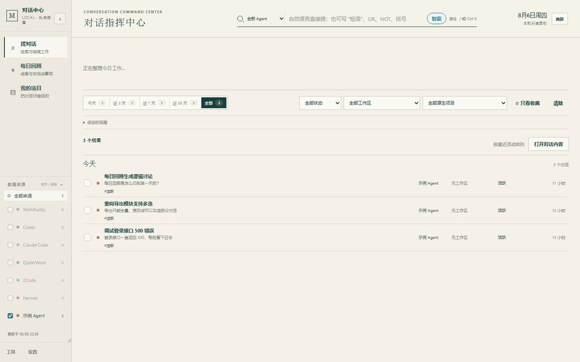
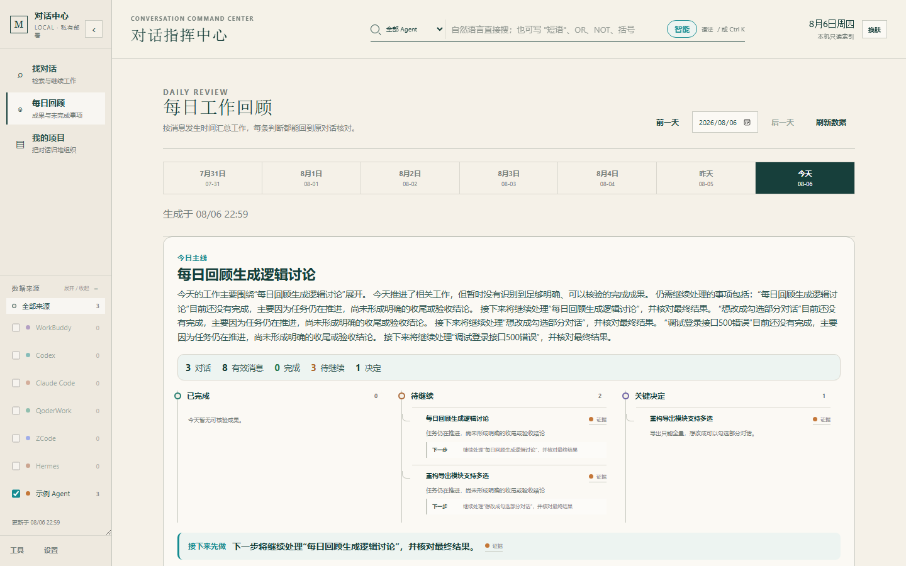
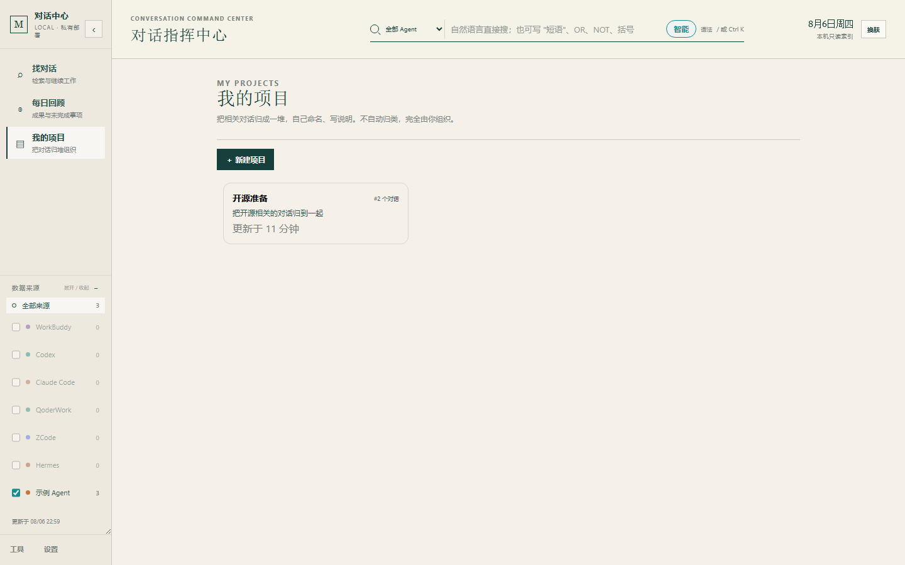
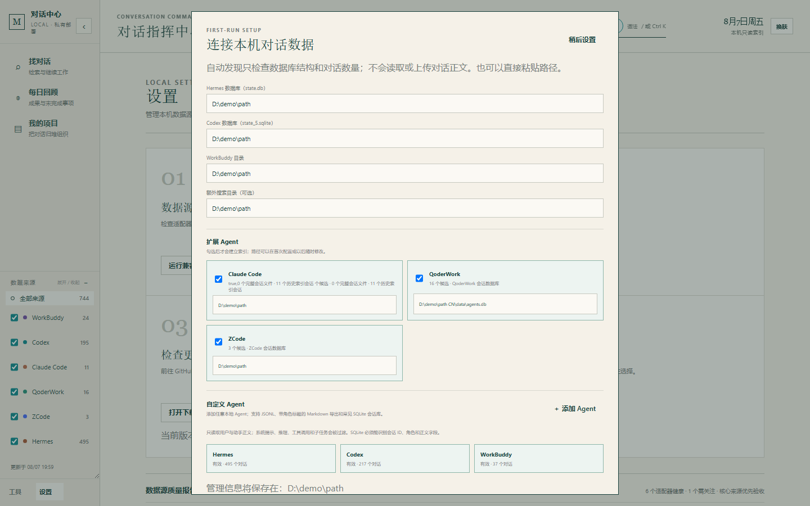
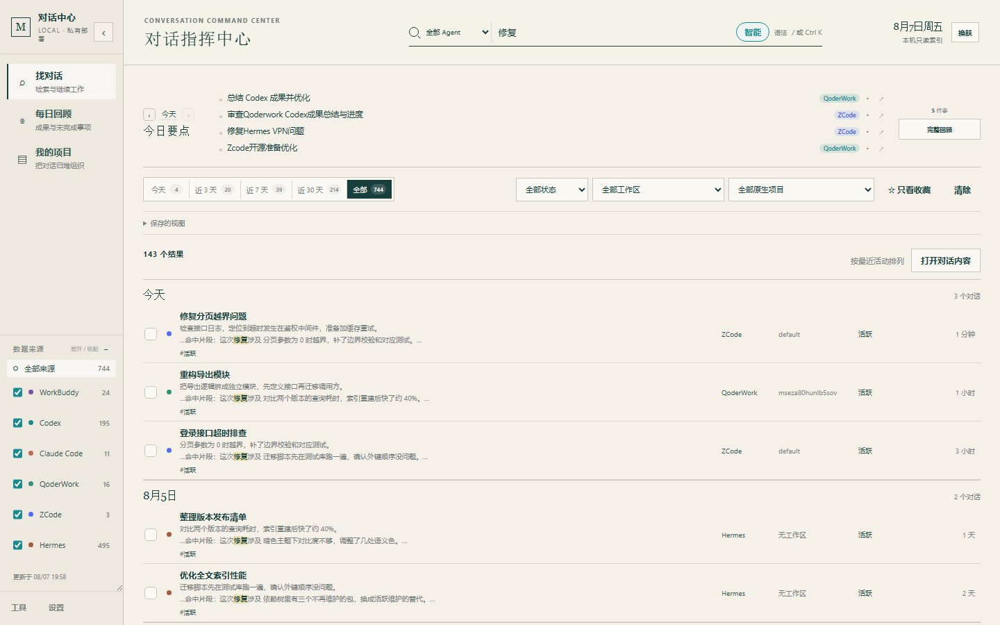
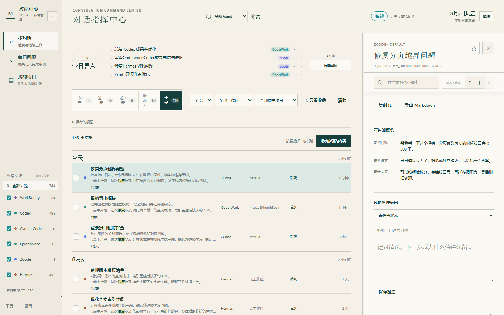
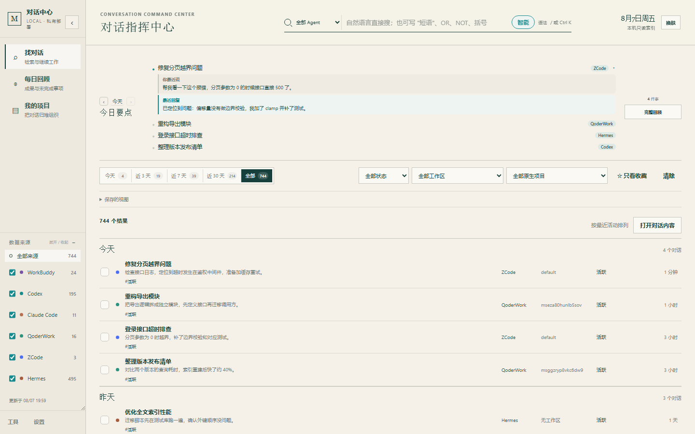

# AI Conversation Hub · Lite

[中文](README_ZH.md) | **English**

> An instant local conversation switchboard for AI coding assistants: search, locate, continue.
> Local-first, zero dependencies, read-only to your original data.

**Current version: v0.4.1**

## What it does

If you work across several AI coding assistants, your conversations live in each one separately. The Hub makes the primary path three steps: **search → select → continue**.

- **Find**: boolean full-text search across all agents' conversations (AND/OR/NOT, phrases, parentheses; supports mixed CJK/Latin like `调试API`)
- **Continue**: exact Codex and WorkBuddy session links, exact Claude Code resume commands, a safe ZCode workspace launcher, and a deterministic handoff packet that any agent can consume
- **Review one conversation**: generate a local retrospective card with goals, completed work, decisions, remaining work, blockers, commits, files, and transcript-level evidence
- **Review**: a fact-based daily recap — overview stats, project progress grouped by workspace, your own status markers (generated offline, no model calls) — so you close each day knowing what actually got done
- **Organize**: check related conversations into named projects with status, notes, and task lists — so the work you did turns into something you can revisit

> This is not another chat client. It is a Windows-first, offline-capable switchboard over the harnesses you already use.

### Speed target

- The listener binds before the full local index is built, so the UI appears immediately
- Real 757-conversation Windows/Python 3.13 benchmark: listener readiness improved from about **1.97 s** to **0.45 s**; first 120-row list loads in about **23 ms**
- A bounded detail cache avoids reparsing the same JSONL on repeated opens

## Screenshots



| Find | Daily Review | Projects |
|---|---|---|
|  |  |  |

## About this project

I built this because I use several AI coding assistants and constantly lose track of "which one did I talk to about this?" — scrolling through each client trying to find it. Since these assistants write so much of my code, I figured they could help solve this headache too.

As a side note, this is the author's first vibe coding project. Bug reports are welcome in [Issues](https://github.com/Mark-Libetter/ai-conversation-hub/issues) — thanks.

## Design principles

| Principle | How |
|---|---|
| **Read-only** | Never writes back to any agent's original data |
| **Local-first** | Runs entirely on your machine; server binds only to `127.0.0.1`; nothing goes to the cloud |
| **Zero dependencies** | Pure Python standard library, no `pip install` needed |
| **Offline-capable** | Search and daily review work fully offline, no model required |
| **Honest capability labels** | Exact session, workspace-level, copied command, and app-only actions are shown as different capabilities |
| **Explicit memory** | Optional memory cards are local, editable, reversible, and excluded from handoff packets by default |

## Quick start

### Requirements
- Python 3.10+ (standard library only)
- Windows / macOS

> ⚠️ **Platform note**: v0.4.1 receives full local Windows testing plus GitHub CI for Windows, macOS, Linux, and the final frozen Windows/macOS bundles. The author still does not have a Mac for real-device acceptance; field reports remain welcome.

### Install A: ask an Agent in one sentence

Send this entire sentence to a Codex, Claude Code, Grok, or other Agent that has terminal and file access:

> Open and follow https://raw.githubusercontent.com/Mark-Libetter/ai-conversation-hub/main/AGENT_INSTALL.md exactly. Install AI Conversation Hub on this computer, discover local paths, configure Agent access, then report the generated AGENT_USAGE.md path and valid sources.

The Agent selects the safe Windows/macOS path, discovers local conversation stores, installs `conversation-hub` and `find-agent-data`, idempotently registers Codex/Grok/WorkBuddy/Qoder MCP entries, and generates a machine-specific `AGENT_USAGE.md`. Existing configuration and unrelated MCP servers are preserved.

Domestic Agent routing for the one-sentence installer:

| Agent | Skill installation | MCP / invocation |
|---|---:|---|
| WorkBuddy | ✅ `~/.workbuddy/skills` | ✅ merges `~/.workbuddy/mcp.json` |
| QwenWorkCN | ✅ `~/.qwenworkcn/skills` | add/update through QwenWork's built-in settings tools when available; otherwise use the generated CLI |
| Qoder / QoderCN | ✅ `~/.qoder/skills` / `~/.qoder-cn/skills` | ✅ merges each user-level `mcp.json` |
| QoderWork | ✅ official `~/.qoderwork/skills` | generated Agent CLI fallback; no guessed private MCP file |

Product-specific paths are written only when that product is detected. Qoder's user-level Skill and MCP capabilities are documented in its official [Skills](https://docs.qoder.com/extensions/skills) and [MCP](https://docs.qoder.com/cli/mcp-servers) guides; QoderWork documents its Skill path in the official [QoderWork Skills guide](https://docs.qoder.com/qoderwork/skills).

### Install B: download a Release bundle

Download and fully extract the matching asset from [GitHub Releases](https://github.com/Mark-Libetter/ai-conversation-hub/releases/latest):

- Windows: run `AIConversationHub.exe`; optionally run `安装Agent接入.bat` for Agent access.
- macOS: run `start-mac.command` and follow the first-run prompts; optionally run `install-agent.command` for Agent access.

The Release includes a standalone `AIConversationHubAgent`, so Python is not required. CI starts each final Windows/macOS bundle and verifies health, all 14 source entries, Agent CLI, and the Grok/Qoder recovery layer before publication.

### Run
```bash
python server.py        # Windows
python3 server.py       # macOS / Linux
```
Open `http://127.0.0.1:8765` in your browser.

### First-time setup

**Step 1: Launch**
- Windows: double-click `launcher.py` (or `修复数据源.cmd`), which starts the server and opens the browser
- macOS: double-click `start-macos.command`
- Command line: `python server.py`, then open `http://127.0.0.1:8765`

> 📂 **Auto-discovery**: Core sources are Codex / Hermes / WorkBuddy. Claude Code / Grok Build / Cursor / QClaw / QoderWork / ZCode / CodePilot / Marvis / Qoder / QoderCN / QwenWorkCN can be validated and enabled in Settings. Manual configuration is needed for non-default or adapter-specific database paths.

Development happens in this source tree. On Windows, a source checkout reuses `%LOCALAPPDATA%\AIConversationHub` for `sources.json` and notes so user data stays out of git. On macOS, notes and `sources.json` live in `~/Library/Application Support/AIConversationHub/UserData`. Grok Build sessions are read from `~/.grok/sessions` on both platforms. Qoder and Grok recovery live in `skills/find-agent-data/agent_recovery/`.

**Step 2: Confirm data sources** (if the sidebar shows no conversations)
1. Click **Settings** ⚙ at the bottom of the sidebar
2. Find **Source Health Center** → click **Configure Paths**
3. Check each agent's path (green = OK, red = wrong path)
4. Paste the correct path → click **Verify & Start**



**Step 3: Search**
1. Type keywords in the search box (e.g., `API fix`) and press Enter
2. Boolean syntax supported: `API OR interface`, `fix NOT test`, `"exact phrase"`, `(A OR B) C`
3. Filter by agent (left sidebar) or time range (top)



**Step 4: Conversation detail**
- Click any conversation to expand full content
- Add favorites ★, tags, notes, status (in-progress / done)
- Search within the current conversation via the top box
- Click **Generate handoff packet** to copy traceable Markdown into another agent; the optional local memory card is off by default



**Step 5: Daily review**
1. Click **Daily Review** in the sidebar
2. View **Today's Highlights**: each item shows its source tag, click to expand recent messages
3. Use ‹ › to switch days, or click the date to open a calendar picker
4. Expand **Full Report**: overview, completed, key decisions, to-continue, next steps



**Step 6: Organize projects**
1. In **Find**, check related conversations (checkbox on the left)
2. Click **Add to Project** → pick existing or create new
3. In **Projects**, view details:
   - **Status**: in-progress / done / paused (click to toggle)
   - **Notes**: key conclusions and decisions
   - **Task list**: lightweight todos
   - **Annotations**: per-conversation notes


**Step 7: Export**
1. Check conversations in **Find**
2. Click **Export Selected** (or use the Tools page)
3. Choose Markdown or JSONL → preview → download

### Desktop launch (Windows)
Double-click `launcher.py` or run `python launcher.py` — starts the server and opens the browser.
`修复数据源.cmd` is a Windows shortcut for repairing data source paths.

The packaged EXE includes an in-process system tray tied to the actual listener port. It can open the Hub, toggle startup, or exit the whole app. The source fallback `start-tray.vbs` uses paths relative to its installation folder.

### Desktop launch (macOS)
Double-click `start-macos.command`. The first time, Control-click it and choose **Open** if Gatekeeper warns. The script starts `launcher.py`, enables Grok Build when `~/.grok/sessions` exists, and opens the browser. Grok continuation launches that computer's Grok CLI when it can be found.

## Built-in data sources

14 adapters shipped:

| Agent | Default discovery location |
|---|---|
| **Hermes** | `~/.hermes/state.db` (override via `CONVERSATION_HUB_HERMES_DB`) |
| **Codex** | `~/.codex/state_5.sqlite` + rollout JSONL (respects `CODEX_HOME`) |
| **WorkBuddy** | `~/.workbuddy/` (respects `WORKBUDDY_HOME`) |
| **Claude Code** | `~/.claude/` |
| **Grok Build** | `~/.grok/sessions/` (respects `GROK_HOME`; reads `summary.json` + `updates.jsonl` only) |
| **Cursor** | `%APPDATA%/Cursor/User/globalStorage/` (requires a compatible `conversation-search.db`) |
| **QClaw** | `~/.qclaw/` |
| **QoderWork** | `%APPDATA%/QoderWork CN/data/agents.db` (also matches renamed `QoderWork` / `QwenWorkCN` / `QwenWork` dirs; old + new data merged automatically) |
| **Qoder / QoderCN** | `%APPDATA%/Qoder*/SharedClientCache/cache/db/local.db` title index + plaintext transcript under `~/.qoder*` (read-only; encrypted message tables are not read) |
| **QwenWorkCN CLI** | `~/.qwenworkcn/` |
| **ZCode** | `~/.zcode/cli/db/db.sqlite` |
| **CodePilot** | Tries `~/.codepilot/`; a compatible DB can also be selected manually |
| **Marvis** | Tries `~/.marvis/state.db`; a compatible DB can also be selected manually |

## Continuation capability matrix

| Source | Primary action | Exact session | Notes |
|---|---|---:|---|
| **Codex** | `codex://threads/<id>` | Yes | Verified against the installed Codex desktop protocol |
| **WorkBuddy** | `workbuddy://chat/<id>` | Yes | Uses WorkBuddy's validated task deep-link grammar |
| **Claude Code** | Launch this computer's `claude --resume <id>` | Yes, if the session JSONL still exists | `history.jsonl` leftovers without `projects/` or `sessions/` files cannot be resumed |
| **Grok Build** | Launch this computer's `grok --resume <id>` | Yes | Discovers `$GROK_HOME/bin` or `~/.grok/bin`, then PATH. Uses only this computer's live `HTTP_PROXY` / `HTTPS_PROXY` (or `extra_sources.grok.proxy`). No hardcoded Clash port |
| **Hermes** | Launch this computer's `hermes --resume <id>` | Yes | Official CLI resume. `hermes://` is only a blueprint deep link, not a session jump |
| **ZCode** | Launch `ZCode.exe --open-workspace <cwd>` | Workspace | Bypasses a conflicting `zcode://` registration; no session-level protocol is claimed |
| **Cursor / QClaw / Marvis / Qoder** | Open app | No | Their CLIs have no verified session-resume flag; only the client/workspace can be opened |
| **QoderWork / CodePilot / custom** | Handoff packet / copy ID / export | No | Safe fallback; no guessed private protocol |

**Want to connect another agent?** Supports JSONL / Markdown / SQLite custom formats, no code changes needed — see [CONTRIBUTING.md](CONTRIBUTING.md).

## Features

### Find
- Boolean full-text search across 14 built-in adapters and custom sources
- Filters: time range, status, workspace, favorites-only
- Conversation detail: overview, favorites, tags, notes, Markdown export
- Batch export of selected conversations

### Cross-agent continuation
- Deterministic Markdown + JSON handoff packets with goal, latest request/response, decisions, next steps, constraints, artifacts, and evidence hashes
- Generated locally on demand; no model call, cloud upload, automatic prompt injection, or command execution
- Optional per-conversation memory card stored in `hub_notes.sqlite`; disabled in packets until the user explicitly checks it
- CLI/MCP access through `python hub_agent.py handoff <source> <id>` and the `hub_handoff` tool

### Projects
- Group related conversations together for review and export
- Project status: in-progress / done / paused
- Project notes: key conclusions and decisions
- Task list: lightweight todos
- Annotations: per-conversation project-level notes

### Daily review
- **Today's Highlights**: lists the day's items with source tags, expand to see recent messages, one-click jump to conversation
- **Full report**: overview, completed, key decisions, to-continue, blocked, next steps
- Date navigation: view any day with calendar picker
- Messages assigned to natural days by timestamp (Asia/Shanghai); long cross-day conversations split correctly
- Rule-based, works offline without a model

## Configuration

Don't commit your real `sources.json`. It's auto-generated on first run; you can also create it manually using [sources.example.json](sources.example.json) as a template. Supported env vars:

```text
CONVERSATION_HUB_DATA_DIR=<Hub data directory>
CONVERSATION_HUB_HERMES_DB=<path to state.db>
HERMES_HOME=<Hermes dir containing state.db>
CONVERSATION_HUB_CODEX_DB=<path to state_5.sqlite>
CODEX_HOME=<Codex home directory>
WORKBUDDY_HOME=<dir containing workbuddy.db and projects>
GROK_HOME=<Grok home, default ~/.grok>
CONVERSATION_HUB_GROK_EXE=<this computer's grok.exe, if not in ~/.grok/bin>
CONVERSATION_HUB_GROK_PROXY=<optional http://127.0.0.1:PORT on this computer>
CONVERSATION_HUB_HERMES_EXE=<this computer's hermes CLI>
CONVERSATION_HUB_CLAUDE_EXE=<this computer's claude CLI>
```

## Agent integration (advanced: let other agents query your conversation archive)

> This section is for advanced users who want to plug the Hub into other AI agents (e.g., Claude Code, Codex) for cross-agent retrieval. Not needed for normal use.

The Hub exposes a **read-only local retrieval API** so any agent (Codex, Claude Code, etc.) can cheaply search across all your assistants' conversation history — a first step toward cross-agent collaboration.

### Option 1: MCP Server (recommended)

```bash
# Claude Code
claude mcp add conversation-hub -- python /path/to/hub_agent.py mcp
```

Exposes 5 tools: `hub_ping` / `hub_search` (cross-agent boolean search) /
`hub_conversation` (tiered reading: cheap summary, or full with char budget) / `hub_daily` / `hub_projects`.

### Option 2: CLI (any agent that can run shell)

```bash
python hub_agent.py search "debug API" --days 7 --limit 5
python hub_agent.py show <source> <conversation_id> --level full --budget 8000
python hub_agent.py daily --date 2026-08-08
python hub_agent.py projects
```

### Option 3: HTTP API

`/agent/search` · `/agent/conversation/{source}/{id}?level=summary|full&budget=N` ·
`/agent/daily` · `/agent/projects` — same port as the web service, `127.0.0.1` only.

**Cost design (tiered retrieval)**: L1 index-level metadata (title/time/snippet, near-zero cost) →
L2 summary-level (conversation overview, cheap) → L3 full-text (`budget` controls char budget, on demand).
90% of agent queries resolve in the first two tiers. Pure Python standard library, zero dependencies.

## Privacy & security

- Original conversation data is **read-only** — the tool never writes back to any agent's database
- Only user/assistant body text is indexed; system prompts, reasoning, tool calls, subtasks, and common secret patterns are filtered out
- Your favorites/notes/tags live in a separate `hub_notes.sqlite`, isolated from source data
- Server binds only to `127.0.0.1`; search and daily review are fully local — nothing is sent to the cloud
- "Check for updates" links directly to GitHub Releases — download and unzip, that's it
- See [PRIVACY.md](PRIVACY.md) and [DESIGN_AND_SAFETY.md](DESIGN_AND_SAFETY.md) for details

## FAQ

**What problem does this solve?**
When you use several AI coding assistants (Codex CLI, Claude Code, Hermes, ZCode, etc.), each stores its conversation logs in a separate directory, with no shared place to search, review, or build on them. The Hub brings them into one local workspace: cross-agent search, daily work review, project memory, tags/favorites, and Markdown export — so the work you do across assistants doesn't stay scattered and forgotten.

**Which AI coding assistants are supported?**
14 built-in adapters: Codex, Claude Code, Hermes, WorkBuddy, Grok Build, Cursor, QClaw, ZCode, QoderWork, Qoder, QoderCN, QwenWorkCN CLI, CodePilot, and Marvis. Other agents can be connected via JSONL / Markdown / SQLite custom sources.

**How do I search all AI conversations on my machine?**
After launching, type keywords in the search box. Supports AND / OR / NOT, `"exact phrases"`, parentheses, and mixed CJK/Latin; filter by agent, time range, status, and tags. Select conversations to batch-export Markdown / JSONL or add to a project.

**Is it private?**
The server binds only to `127.0.0.1`: no LAN listening, no cloud sync, no telemetry. All agent source data is read-only. Pure Python standard library — the code is fully auditable. See [PRIVACY.md](PRIVACY.md).

**What do I need?**
Python 3.10+ (standard library only, no `pip install`), Windows / macOS; or just run the prebuilt desktop version.

## Roadmap

- **Web-based chat import** (reserved, not yet built): ChatGPT / Qwen / Gemini / Claude web editions store chats on their servers — no reliable local data source. Plan: read browser-exported `conversations.json` / Markdown / JSON (see formats from [chatgpt-exporter](https://github.com/pionxzh/chatgpt-exporter), [AI-Chat-Md-Export](https://github.com/YunAsimov/AI-Chat-Md-Export)). For now, use custom sources (Markdown/JSON) to import manually.

## Project structure

```
server.py           # Backend: HTTP server + indexing + search + daily review
source_adapters.py  # Data source adapters (14 built-in + custom source framework)
agent_cli.py         # Agent CLI/MCP entry; starts the local Hub when needed
agent_setup.py       # Path discovery, Skill install, MCP registration, usage guide
static/
  app.js            # Frontend logic
  index.html        # Page structure
  app.css           # Styles
launcher.py         # Cross-platform desktop launcher (starts server + opens browser)
desktop_app.py      # Desktop app shell
app_paths.py        # Data/asset path resolution (incl. macOS path conventions)
repair_sources.py   # Data source repair tool (修复数据源.cmd is its Windows shortcut)
AGENT_INSTALL.md    # One-sentence installation protocol for an Agent
start-macos.command # macOS double-click launch script
sources.example.json# Data source config example
```

## License

This project is licensed under the **MIT** License.

- ✅ You are free to use, modify, share, and commercialize
- ✅ You must retain the original copyright and license notice
- Software is provided "as is", without warranty of any kind

See [LICENSE](LICENSE) for details.

## Acknowledgments

This project grew out of personal AI coding practice. Thanks to the designers of all the AI coding assistants it connects to.
