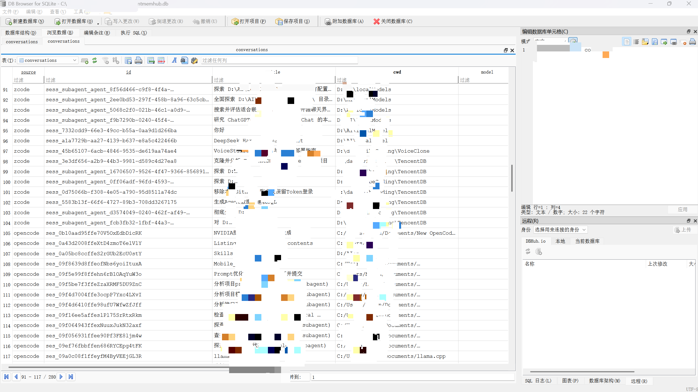
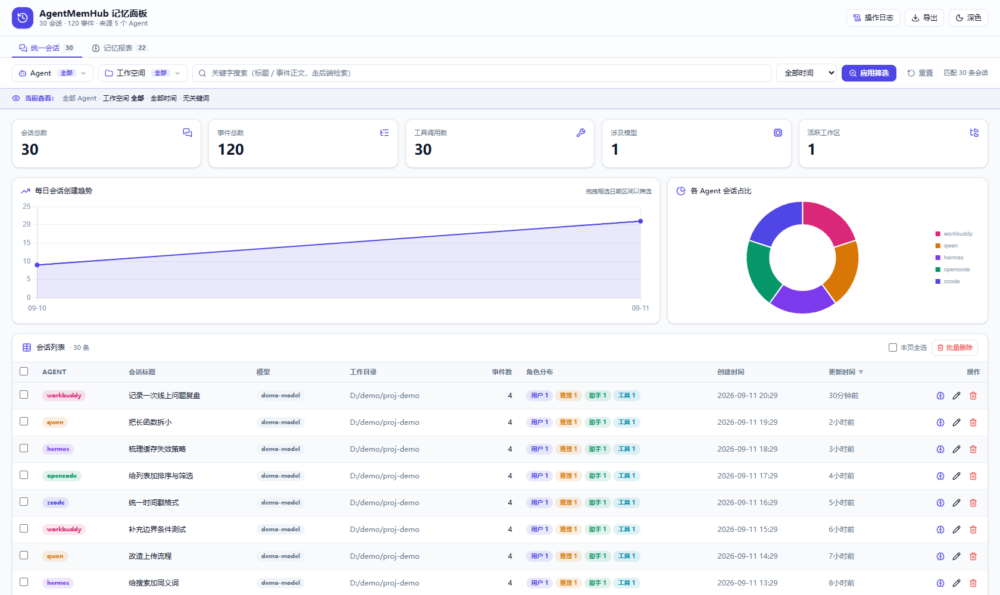
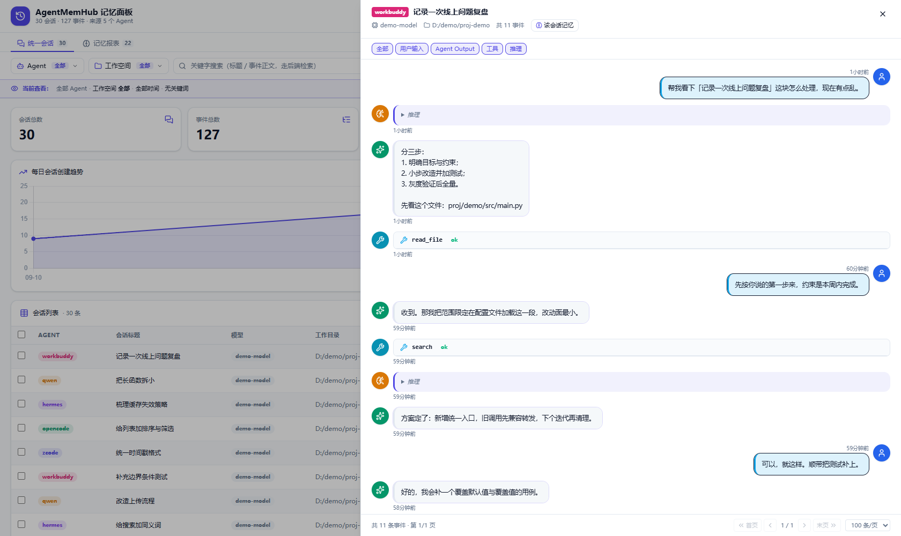

# AgentMemHub

统一提取你电脑上所有 AI Agent Harness 的对话历史 → 归一为**全量事件流**（含工具链、思维链、Shell 执行、代码补丁）→ 本地 SQLite 存储可搜索 → 导出 JSONL / Markdown → 桥接 [MemOS Local Plugin](https://github.com/MemTensor/MemOS) 生成记忆。

**让任何 Agent 的会话经验，变成可检索、可迁移、可复用的统一记忆资产。**

## 支持的 Agent

| Agent | 数据来源 | 格式 |
|---|---|---|
| **ZCode** | `~/.zcode/cli/db/db.sqlite` | SQLite |
| **OpenCode** | `~/.local/share/opencode/opencode.db` | SQLite |
| **Hermes** | `%LOCALAPPDATA%\hermes\state.db` | SQLite |
| **WorkBuddy** | `~/.workbuddy/workbuddy.db` + audit-log | SQLite + JSONL |
| **Qwen** | `~/.qwen/projects/*/chats/*.jsonl` | JSONL |
| **QoderCN** | `~/.qoder-cn/.../*.jsonl` | JSONL |
| **DSH** | `~/.dsh/sessions/*/session.jsonl.zstd` | zstd JSONL |

## 项目架构

```
   ┌───────────────────────────── AgentMemHub（本项目） ─────────────────────────────┐
   │                                                                                 │
   │  采集层                        存储层                 消费层                     │
   │  ┌──────────────┐           ┌────────────┐     ┌────────────────────┐          │
   │  │ adapters/    │  ingest   │ SQLite 会话库│    │ CLI（7+ 子命令）      │          │
   │  │ 7 个数据源     │ ────────▶│ (store.py) │     │ 控制台（start.bat）    │          │
   │  │ (sqlite/jsonl)│           │ events+fts │     │ Web 看板（/api/*）    │          │
   │  └──────────────┘           └─────┬──────┘     └────────┬───────────┘          │
   │                                  │                      │                      │
   │   记忆层   ┌──────────────────────┼──────────────────────┘                      │
   │            ▼                      ▼                                             │
   │      统一事件流         bundle 生成（memos.py，幂等/价值启发式）                    │
   │            │                      │                                             │
   │            │                      ▼                                             │
   │            │             ┌────────────────┐    ┌─────────────────┐              │
   │            │             │ 引擎托管        │    │ 上游引擎 MemOS    │              │
   │            └────────────▶│ memos_daemon.py│──▶│ (项目内 memOS/)   │              │
   │          （检索/看板/导出）│ 启停/状态/密码/开关│    │ 记忆库+进化链      │              │
   │                          └────────────────┘    └─────────────────┘              │
   │                                                                                 │
   │   配置层：agentmemhub.yaml（全路径可配置）＋ 环境变量覆盖                           │
   └─────────────────────────────────────────────────────────────────────────────────┘
```

**目录结构**

```
AgentMemHub/
├── agentmemhub/                  # 核心包
│   ├── cli.py                    # 命令行入口（无参数进控制台）
│   ├── console.py                # 交互式控制台（环境检测/提取/检索/看板/记忆推送）
│   ├── config.py                 # 统一配置体系（YAML + 环境变量 + 默认）
│   ├── store.py + schema.sql     # SQLite 会话库（conversations/events/events_fts）
│   ├── memos.py                  # MemOS bundle 桥接（幂等导入/价值/rebuild）
│   ├── memos_daemon.py           # 记忆引擎托管（启停/状态/密码自动登录/轻量开关）
│   ├── adapters/                 # 7 个 Agent 数据源适配器（src_id/turn_key/注入识别）
│   └── web/                      # FastAPI 看板 + 前端 + /api/memos 记忆网关
├── memOS/                        # 上游记忆引擎（已平移进项目，gitignore）
│   ├── apps/memos-local-plugin/  #   引擎程序 + npm 依赖 + 本地嵌入模型
│   └── home/                     #   引擎数据：记忆库 memos.db / viewer 密码 / 引擎配置
├── agentmemhub.yaml(.example)    # 统一配置文件（复制 example 按需修改）
├── exports/                      # 导出产物（gitignore）
├── scripts/                      # 验证/安全检查/E2E 脚本
├── tests/                        # pytest（22 项）
└── start.bat                     # Windows 一键入口（双击进控制台）
```

**数据流（三阶段闭环）**

1. **采集**：`ingest` 从各 Agent 的官方数据位置读取会话（路径可经 `agents.*` 配置覆盖），归一为全量事件流（含工具链/思维链/Shell/补丁，每事件带 `src_id`/`turn_key` 稳定锚与系统注入标记）写入本地 SQLite
2. **消费**：CLI/控制台/Web 看板检索、浏览、导出、管理会话——全部读本地库，不上传任何数据
3. **记忆**：`memos` 把事件流转成 MemOS bundle（幂等、按轮分组、带价值信号）→ 经引擎托管通道导入项目内 `memOS/`，之后对话时可被语义检索命中

## 快速开始

**方式 A — 控制台（推荐，新用户入口）**

```bash
# Windows 双击 start.bat，或命令行无参数直接进入菜单：
uv run python -m agentmemhub
```

菜单涵盖：环境检测（各 Agent 数据源/库规模/记忆引擎在线状态）→ 提取入库 → 检索 → 启动看板 → 推送记忆 → 引擎启停 → 退出。

**方式 B — 命令行**

```bash
# 1. 提取所有 Agent 并入库
uv run python -m agentmemhub ingest

# 2. 搜索（FTS5 英文 + 中文子串）
uv run python -m agentmemhub search "登录"

# 3. 查看某个会话（Markdown，含思维链+工具）
uv run python -m agentmemhub show zcode sess_xxxx

# 4. 导出全量（JSONL 每行一事件 / Markdown 可读）
uv run python -m agentmemhub export --format jsonl --out exports/
uv run python -m agentmemhub export --format markdown --out exports_md/

# 5. 生成 MemOS 导入 bundle
uv run python -m agentmemhub memos --out exports/memos_bundle.json

# 6. 推送到运行中的 MemOS 记忆引擎
uv run python -m agentmemhub memos --push http://127.0.0.1:18800
```

## 查询示例

```bash
# ---- 关键词搜索 ----
# 中文自动走 LIKE 子串匹配，英文/词组走 FTS5 全文索引
python -m agentmemhub search "登录"                        # 全部 7 个来源
python -m agentmemhub search "登录" --source zcode         # 只搜某个来源
python -m agentmemhub search "登录" --role tool            # 只搜工具事件
python -m agentmemhub search "登录" --role reasoning       # 只搜思维链
python -m agentmemhub search "登录" --limit 50             # 条数限制（默认 20）

# ---- 查看单个会话（Markdown，含思维链/工具/补丁渲染）----
python -m agentmemhub show zcode sess_d8648672-3cc8-4bbc-8e4f-3e50afc6b032
python -m agentmemhub show opencode ses_0b10aad95ffe70V5

# ---- 列出会话 ----
python -m agentmemhub list                        # 全部来源
python -m agentmemhub list --source hermes        # 只列某个来源
```

## 导出示例

```bash
# 导出为 JSONL：每个会话一个 <source>__<session_id>.jsonl，每行一个事件
python -m agentmemhub export --format jsonl --out exports/
# → exports/zcode__sess_d86486....jsonl, exports/opencode__ses_0b10....jsonl, ...

# 导出为 Markdown：人类可读，含 👤用户/💭思考/🔧工具/📝修改 渲染
python -m agentmemhub export --format markdown --out exports_md/
# → exports_md/zcode__sess_d86486....md, ...

# 只导出某个来源、指定输出目录
python -m agentmemhub export --format markdown --source zcode --out exports_zcode/

# 导出后导入 MemOS（先启动 MemOS Local Plugin）
python -m agentmemhub memos --out exports/memos_bundle.json              # 生成 bundle
python -m agentmemhub memos --push http://127.0.0.1:18800              # 或直接推送
```

导出的 JSONL 每行就是一个标准事件：

```jsonc
{"role":"user","content":"帮我修复登录页面","time":1750000001}
{"role":"reasoning","content":"登录按钮没反应，先看代码","time":1750000002}
{"role":"tool","tool_name":"Bash","tool_input":{"command":"npm test"},"tool_output":"FAIL src/login.ts","tool_status":"completed","time":1750000003}
```

## 数据与文件存放位置

| 内容 | 默认位置 | 覆盖方式 |
|---|---|---|
| SQLite 数据库 | `~/.agentmemhub/agentmemhub.db` | 环境变量 `AGENTMEMHUB_DB` 或 `AGENTMEM_HUB_DATA_DIR` |
| 导出目录 | 项目下 `exports/` | `--out` 参数 |
| MemOS bundle | `exports/memos_bundle.json` | `--out` 参数 |

数据库三张核心表：

- `conversations` — 会话元数据（source / id / title / cwd / model / 时间）
- `events` — 全量事件流（role / content / tool / reasoning / patch / shell，含 `raw_json` 原始保底）
- `events_fts` — FTS5 全文索引（英文检索）



> `exports/` 已加入 `.gitignore`，含真实对话的导出不会进入仓库。

## 编程访问（Python）

核心存储层可直接编程调用：

```python
from agentmemhub.store import Store

store = Store()                                  # 默认 ~/.agentmemhub/agentmemhub.db
convs = store.list_conversations("zcode")        # 列出 zcode 的会话
events = store.get_events("zcode", "<session-id>")  # 读取某会话事件流
hits = store.search("登录", role="tool")          # 搜索工具事件
```

## 统一事件流（全量保留）

不丢弃工具链、思维链、Shell 执行、代码补丁——每行一个 JSON 事件：

```jsonc
{"role":"user","content":"帮我修复登录页面","time":1750000001}
{"role":"reasoning","content":"登录按钮没反应，先看代码","time":1750000002}
{"role":"tool","tool_name":"Bash","tool_input":{"command":"npm test"},"tool_output":"FAIL src/login.ts","tool_status":"completed","time":1750000003}
{"role":"assistant","content":"是事件监听器问题","model":"claude-x","time":1750000004}
{"role":"patch","patch_file":"src/login.ts","patch_diff":"@@ -12,3 +12,5 @@","time":1750000005}
```

每个事件保留 `raw_json`（各 Agent 原始 JSON）实现**无损保底**。

## 命令行

| 命令 | 说明 |
|---|---|
| `ingest [--source x]` | 提取全部/指定 adapter 并入库 |
| `list [--source x]` | 列出会话 |
| `show <source> <id>` | 查看会话（Markdown）|
| `search <q> [--source] [--role] [--limit]` | 全文搜索事件正文 |
| `export --format jsonl\|markdown [--source] [--out dir]` | 导出 |
| `folders [--source] [--limit]` | 按文件夹统计各 Agent 会话数 |
| `memos [--source] [--out] [--push url] [--no-rebuild]` | 生成/推送 MemOS bundle（push 自动分批 + 补向量）|
| `memos-daemon start\|stop\|status\|logs` | 记忆引擎托管（见下文「记忆引擎管理」）|
| `mcp [--http] [--bind H] [--port P]` | MCP 记忆网关：默认 stdio（Agent 拉起）；`--http` 常驻为 Streamable HTTP 供团队共享 |
| `sync [--push URL] [--no-rebuild] [--full]` | 增量同步：ingest → **只推送上次同步后的新增会话**（时间锚，无新增自动跳过；`--full` 强制全量）→ 补向量（幂等，引擎离线跳过推送且不推进锚）|
| `clean [--source x] [--apply]` | 记忆清洗：删除系统注入事件（默认预览，`--apply` 才执行并重建 FTS/计数）|
| `score [--limit N] [--dry-run] [--workers N] [--ids id1,id2] [--unscored-count]` | LLM 批量自动评分历史记忆（三轴评估 → feedback 写入价值分；跳过已评；`--ids` 只评指定条（写后即评/锚点用），`--unscored-count` 仅统计未评分条数供定时/定量触发判断）|
| `rebuild [--mode repair\|rebuild]` | 补向量：触发引擎 embedding rebuild（导入记忆后修复语义检索）|
| `stats` / `adapters` | 统计 / adapter 状态 |

> 更完整的代码与 SQL 示例（按 Agent 查询、按文件夹跨 Agent 统计、会话角色分布、直连数据库等）见 **[docs/EXAMPLES.md](./docs/EXAMPLES.md)**。

## MCP 记忆网关（实时记忆读写）

把本地记忆引擎（MemOS）的语义检索/写入包装成 **MCP server**，挂在 ZCode / OpenCode /
Claude Code 等支持 MCP 的 Agent harness 上——模型在会话进行中即可检索历史记忆、
主动保存值得长期保留的结论。与离线链路（统一提取 → bundle → 导入）互补：

| 工具 | 说明 |
|---|---|
| `memory_search(query, topK)` | 语义检索历史记忆（转发引擎 `/api/v1/memory/search`），返回命中条目 + 注入上下文 |
| `memory_recent(limit)` | 最近写入的记忆时间线，快速了解近期积累 |
| `memory_stats()` | 引擎在线状态 / 记忆总量 / 语义检索与 LLM 评分可用性 / 记忆模式 |
| `memory_save(content)` | 写一条记忆（即时入库并补向量），供模型主动保存事实/结论 |

```bash
# 0. 先常驻记忆引擎（网关绝不代管其生命周期）：
python -m agentmemhub memos-daemon start

# 用法一：本地个人（stdio，Agent 拉起子进程）——见下方「注册配置」
# 用法二：团队共享（Streamable HTTP，一台机器常驻网关）：
python -m agentmemhub mcp --http --bind 0.0.0.0 --port 9100

# 验证：在 Agent 会话里调用 memory_stats / memory_search
```

### 注册配置（两种传输的 MCP 配置直接贴这里）

> ⚠️ **记得把下方 `<项目根>` 替换为你机器上的实际路径**（例如 `D:/path/to/AgentMemHub`）。
> 不要用 `uv run python`——MCP 子进程在项目目录之外启动时会解析到错误的 python（No module named agentmemhub）。
> ZCode 写在 `mcp.json` 的 `mcpServers` 段；OpenCode 写在 `opencode.json` 的 `mcp` 段（模板另见 [docs/mcp-register.example.json](./docs/mcp-register.example.json)）。

**A. 本地个人（stdio）**

```json
{
  "mcpServers": {
    "agentmemhub": {
      "type": "stdio",
      "command": "<项目根>/.venv/Scripts/python.exe",
      "args": ["-m", "agentmemhub", "mcp"],
      "env": {}
    }
  }
}
```

OpenCode 对应写法（含裸命令备选：`pip install -e .` 后把 `.venv/Scripts` 加入 PATH，command 直接用 `agentmemhub-mcp`）：

```json
{
  "mcp": {
    "agentmemhub": {
      "type": "stdio",
      "command": "<项目根>/.venv/Scripts/python.exe",
      "args": ["-m", "agentmemhub", "mcp"],
      "enabled": true
    }
  }
}
```

**B. 团队共享（Streamable HTTP）**

服务端先常驻：`python -m agentmemhub mcp --http --bind 0.0.0.0 --port 9100`（默认只监听 127.0.0.1，开放局域网需显式 `--bind 0.0.0.0` 并自行做好访问控制）。客户端注册：

```json
{
  "mcpServers": {
    "agentmemhub": {
      "type": "http",
      "url": "http://<服务器IP或hostname>:9100/mcp"
    }
  }
}
```

> 两种传输的工具完全一致（`memory_search` / `memory_recent` / `memory_stats` / `memory_save`），按场景选一种即可。

设计要点：

- **引擎由用户常驻控制**（看板 / `memos-daemon`）；网关只转发请求，引擎离线时所有工具
  返回明确错误与启动指引（isError），不做启停决策
- **协议层与传输层分离**：stdio 零新依赖；Streamable HTTP 复用 web 依赖
  （fastapi/uvicorn），`POST /mcp` 单端点（GET 405、DELETE 结束会话），
  兼容 MCP 2024-11-05 / 2025-06-18
- 复用引擎网关的自动登录（已保存密码时免密直连）；不写本地库、不改引擎源码

## 数据模型

- **conversations**：会话元数据（source/id/title/cwd/model/时间/signature）
- **events**：全量事件流（role/content/tool/reasoning/patch/shell/raw_json）
- **events_fts**：FTS5 全文索引（英文走 FTS，中文子串走 LIKE 兜底）

详见 [ARCHITECTURE.md](./ARCHITECTURE.md)。

## 记忆引擎管理（MemOS 已集成进项目）

本项目把 [MemOS Local Plugin](https://github.com/MemTensor/MemOS) 作为**上游记忆引擎**集成——AgentMemHub 只负责调用其接口与托管其进程，不修改其源码。MemOS 默认平移到项目内 `memOS/` 目录（`repo_dir` 可配置到任意位置）：

```
AgentMemHub/
├── agentmemhub/                 ← 本项目代码
├── memOS/                       ← 上游引擎（已 gitignore，不入库）
│   ├── apps/memos-local-plugin/ ← 引擎程序（npm 依赖 + 本地嵌入模型随项目）
│   └── home/                    ← 引擎数据：记忆库 memos.db、viewer 密码、引擎配置
└── agentmemhub.yaml             ← 可选：统一配置文件（复制自 example）
```

引擎托管（启动/停止/巡检/日志/配置开关）：

```bash
uv run python -m agentmemhub memos-daemon start        # 拉起引擎（memOS/home 自动注入）
uv run python -m agentmemhub memos-daemon stop         # 停止（仅停本工具拉起的实例）
uv run python -m agentmemhub memos-daemon status       # 巡检：在线/鉴权/路径/记忆规模/轻量模式
uv run python -m agentmemhub memos-daemon logs         # 查看引擎日志
uv run python -m agentmemhub memos-daemon --lightweight off   # 完整进化链（新对话自动评分/归纳）
uv run python -m agentmemhub memos-daemon --lightweight on    # 轻量模式（只写记忆不进化）
uv run python -m agentmemhub memos-daemon --set-password <密码>  # 引擎 viewer 设了密码时保存（网关自动登录）
```

要点：

- **密码自动登录**：引擎 viewer 设置了密码（`.auth.json`）后，网关遇 401 会用保存的密码自动登录，看板/检索不受影响
- **MemOS 页面**：平移后需构建一次 viewer（`cd memOS\apps\memos-local-plugin && npm run build:viewer`）；升级引擎或重装 node_modules 后重跑
- **本地嵌入模型（`npm install` 会清掉）**：引擎的本地嵌入模型文件在 `memOS/apps/memos-local-plugin/node_modules/@huggingface/transformers/models/Xenova/bge-small-zh-v1.5/`，**不属于 npm 依赖**——重装依赖会被删除，嵌入会失效；重装后执行 `uv run python scripts/download_embedding_model.py` 恢复（断点续传 + 大小校验，默认回填本项目的 bge-small-zh-v1.5；换模型用 `--model Xenova/…`，镜像源用 `--base https://hf-mirror.com`）
- **完整进化链**：`--lightweight off` 后新对话自动跑 reward 打分 / 经验归纳 / 技能结晶（需要引擎配置了 LLM）；历史导入记忆保持价值 0，仍可被检索

## 统一配置

所有路径/端口默认采用官方默认；需要覆盖时创建 `agentmemhub.yaml`（模板见 `agentmemhub.yaml.example`）。优先级：环境变量 > 配置文件 > 内置默认。

```yaml
data_dir: "~/.agentmemhub"            # 本地库/日志/托管状态
db_path: ""                           # 会话库 SQLite（默认 <data_dir>/agentmemhub.db）
agents:
  zcode: ""                           # 各 harness 会话位置；留空=官方默认自动发现
  hermes: ""                          # 例：系统盘不在 C: 时指向 D 盘镜像数据
  ...
memos:
  repo_dir: ""                        # MemOS 项目根（默认 <项目根>/memOS）
  plugin_dir: ""                      # 留空自动推导 <repo_dir>/apps/memos-local-plugin
  home: ""                            # 引擎数据目录（默认 <repo_dir>/home）
  base_url: "http://127.0.0.1:18800"
  password: ""                        # caller viewer 密码（自动登录用）
  lightweight: ""                     # true/false 强制；留空=引擎自身配置
web:
  port: 8086
```

相对路径相对项目根解析，`~` 展开为用户目录。

## 需求

- Python 3.10+
- `pip install zstandard`（仅 DSH 需要）

## Web 页面（可选）

不想敲命令行？启动本地 Web 仪表盘，在浏览器里浏览/搜索/管理所有 Agent 会话：

```bash
# 首次：安装 web 可选依赖（fastapi + uvicorn）
uv pip install -e ".[web]"

# 启动（默认 http://127.0.0.1:8086，--open 自动打开浏览器）
uv run python -m agentmemhub serve
uv run python -m agentmemhub serve --port 9000 --no-open --db D:/path/to/agentmemhub.db
```

功能：Agent/工作空间多选筛选 · 服务端分页列表 · 全文搜索（FTS5+LIKE）· 统计卡与图表 ·
会话详情抽屉（用户消息/思维链/工具调用/代码补丁 全渲染，按记忆轮次分组）· 标题编辑与会话删除（真实写库）。
引擎在线时画面下方有**「记忆引擎」板块**：运行状态（含托管标识/记忆规模/向量就绪）、
语义检索框（直接搜历史记忆）、最近记忆列表（value 正负标注 + 👍/👎 单条打分）、
一键启动/停止与打开引擎页面链接。下方还有**「数据操作」**（按流程排序）：
**提取会话入库** → **清洗数据**（删系统注入，带确认弹窗）→ **推送记忆到 MemOS**（幂等导入 + 自动补向量）→
**补向量**（embedding rebuild）→ **自动评分**（LLM 三轴批量补价值分，进度条 + 百分比，未完成封顶 99%）——
全部为后台任务，**进度条按百分比分级配色**、结果实时回显、同一时刻只允许一个任务；
顶部与数据操作区均有**「操作日志」**入口（引擎启停/任务提交执行/打分等记录，留存于 `<程序根>/logs/`，重启可查）。
MemOS 未安装时板块自动隐藏。





设计要点：

- **大库友好**：事件流不预载——只有点开某条会话的抽屉时才从后端按需加载该会话的事件；
  超长会话自动截断（前 88 + 后 12 条）并标注；统计聚合下推 SQL 且带 TTL 缓存
- **离线可用**：Tailwind / lucide / Chart.js 已本地化到 `agentmemhub/web/static/vendor/`
- **只绑定 127.0.0.1**，不上传任何数据；Swagger 文档在 `/api/docs`
- 前端由 `WebsiteDesign` 设计稿改造而来，接口契约见 `docs/` 与 `/api/docs`

## 隐私与脱敏

本项目**本地运行、不上传任何数据**。推送到公开仓库的部分严格脱敏：

- 代码用 `Path.home()` / 环境变量在运行时发现路径，**不硬编码真实用户名或绝对路径**
- 敏感配置用示例文件给出：`.env.example`（环境变量占位）、`scripts/sensitive_scan.py`（敏感扫描）
- 真实会话导出默认为 `exports/`（已在 `.gitignore`，勿强制推送）
- 详细规则见 [SECURITY.md](./SECURITY.md)

## Roadmap

- [x] 统一事件模型 + SQLite 存储（FTS5）
- [x] 7 个 Agent Adapter（含 src_id/turn_key 稳定锚与系统注入识别）
- [x] 全量检索 + JSONL/Markdown 导出
- [x] MemOS bundle 桥接（幂等导入 + 价值启发式 + embedding 自动补齐）
- [x] Web 仪表盘（FastAPI + 原生 JS，服务端分页、事件按需加载、真删改）
- [x] 交互式控制台入口（start.bat / 无参数菜单）
- [x] 记忆引擎一体化管理（MemOS 平移进项目 + 启停/巡检/看板记忆板块）
- [x] 统一配置体系（agentmemhub.yaml：全路径可配置）
- [x] MCP 记忆网关（stdio / Streamable HTTP 双传输，供 ZCode/OpenCode 等 harness 检索/写入记忆）
- [x] 记忆清洗（clean：删除系统注入事件，预览→执行并重建 FTS/计数）
- [x] LLM 批量自动评分（score：三轴评估写价值分、跳过已评、面板进度条）
- [x] 统一日志（`<程序根>/logs/`：web/cli/engine/tasks 分文件，面板可查历史）
- [ ] 更多 Agent（Claude Code / Cursor / Gemini CLI / CodeBuddy）
- [ ] 记忆折叠压缩（超长会话压缩、相邻轮折叠）

